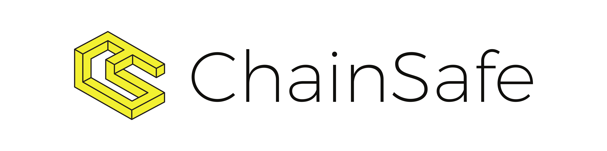

# Chainbridge by ChainSafe - Connecting Ethereum and Moonbeam

**Disclaimer:** Projects themselves entirely manage the content in this guide. Moonbeam is a permissionless network. Any project can deploy its contracts to Moonbeam.

## Introduction

ChainBridge is a modular, multi-directional bridge to interact with multiple networks, either EVM or Substrated-based chains. ChainBridge's implementation in Moonbeam is focused on connecting it to Ethereum using both EVM implementations.

At a high-level, ChainBridge is a message-passing protocol. A set of relayers are constantly looking for events, in either side of the bridge, which trigger a set of actions. Once a triggering event is noted, a set of relayers vote to execute the instructions (included in the event) in the chain on the other side of the bridge.

For example, the bridge can be used to transfer ERC-20 or ERC-721 natively. A set of handler contracts are pre-configured to handle both token standards. At its core, the token transfer mechanism works with a lock-mint, burn-unlock mechanism. First tokens are locked in the source chain, and an event is emitted, which is listened to by the relayers. Then, they vote and (if approved) execute the mint function, giving the same amount of tokens locked in the target chain to the corresponding address.

You can read more about ChainBridge (and ChainSafe) in the following links:

 - [ChainSafe Website](https://chainsafe.io/)
 - [ChainSafe Github](https://github.com/chainsafe)
 - [ChainBridge documentation](https://chainbridge.chainsafe.io/)
 - [ChainBridge GitHub](https://github.com/ChainSafe/ChainBridge)

You can contact the team via the following communication channels:

 - [Discord](https://discord.gg/xSAwrnCWcg)
 - [Twitter](https://twitter.com/ChainSafeth)
 - [LinkedIn](https://www.linkedin.com/company/chainsafe-systems)

## Moonbase Alpha Implementation

ChainBridge is currently connecting the Moonbase Alpha TestNet with both Kovan and Rinkeby Ethereum's TestNets. You can find a detailed tutorial on how to use the bridge in [this site](/integrations/bridges/ethereum/chainbridge/).

### Moonbase Alpha - Rinkeby

You can find all the contract's addresses that are relevant for the Moonbase Alpha - Rinkeby bridge in the following table:

|                  Contract                  |                          Address                           |
| :----------------------------------------: | :--------------------------------------------------------: |
|                   Bridge                   | {{ networks.moonbase.chainbridge.rinkeby.bridge_address }} |
|               ERC20 Handler                | {{ networks.moonbase.chainbridge.rinkeby.ERC20_handler }}  |
|               ERC721 Handler               | {{ networks.moonbase.chainbridge.rinkeby.ERC721_handler }} |
|                ERC20S Token                |     {{ networks.moonbase.chainbridge.rinkeby.ERC20S }}     |
| ERC721M Token (mintable on Moonbase Alpha) |    {{ networks.moonbase.chainbridge.rinkeby.ERC721M }}     |
|    ERC721E Token (mintable on Rinkeby)     |    {{ networks.moonbase.chainbridge.rinkeby.ERC721E }}     |

### Moonbase Alpha - Kovan

You can find all the contract's addresses that are relevant for the Moonbase Alpha - Kovan bridge in the following table:

|                  Contract                  |                         Address                          |
| :----------------------------------------: | :------------------------------------------------------: |
|                   Bridge                   | {{ networks.moonbase.chainbridge.kovan.bridge_address }} |
|               ERC20 Handler                | {{ networks.moonbase.chainbridge.kovan.ERC20_handler }}  |
|               ERC721 Handler               | {{ networks.moonbase.chainbridge.kovan.ERC721_handler }} |
|                ERC20S Token                |     {{ networks.moonbase.chainbridge.kovan.ERC20S }}     |
| ERC721M Token (mintable on Moonbase Alpha) |    {{ networks.moonbase.chainbridge.kovan.ERC721M }}     |
|     ERC721E Token (mintable on Kovan)      |    {{ networks.moonbase.chainbridge.kovan.ERC721E }}     |

### ChainBridge UI

Currently, there is a UI available for ChainBridge. You can find the related repository [here](https://github.com/ChainSafe/chainbridge-ui)
