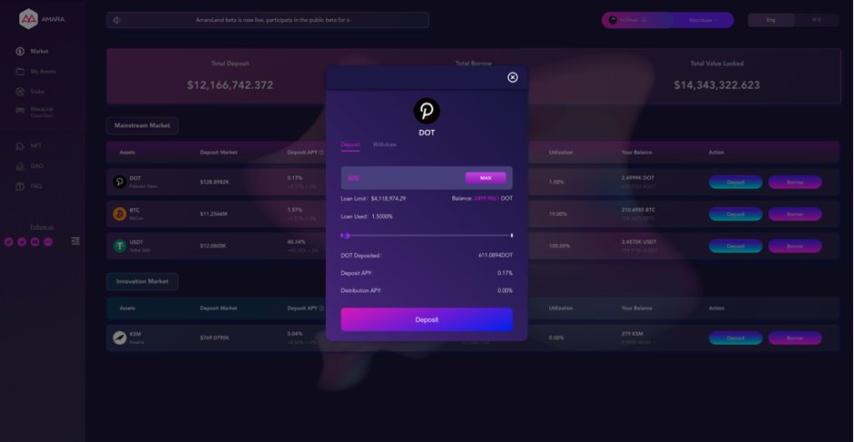

# AmaraLend - An Multi-Chain Lending Platform on Moonbeam

**Disclaimer:** Projects themselves entirely manage the content in this guide. Moonbeam is a permissionless network. Any project can deploy its contracts to Moonbeam.

## Introduction

AmaraLend Beta is a top lending market providing lending service for all holders within Polkadot ecosystem.

AmaraLend is a multi-chain protocol planning to deploy on every top-notch parachain within Polkadot.

Moonbeam is fully compatible with Ethereum EVM and Substrate, which is friendly to developers and the best start for them to enter the Polkadot ecosystem.The first Polkadot parachain AmaraLend deployed on is Moonbeam. Currently, AmaraLend Beta has been on Moonbase Alpha for testing and after which it will be officially deployed on the Moonriver network.

**AmaraLend complete version will be featured:**

- **Multi-chain Deployment：**AmaraLend plans to realize multi-chain deployment on Polkadot top-notch parachain.
- **Graded Market**: Amara develops both the mainstream assets market and innovation market. The long-tail quality assets will be included in the innovation market to fully release the liquidity. The AmaraLend lending market embraces popular assets within Polkadot.
- **NFT Incentive system：**Integrae NFT into community positive incentive system to reward active members.
- **Cross-chain Bridge：**Amara has developed multi-signature aseet cross-chain protocol MaraLink to introduce popular public chains into Polkadot ecosystem. Please refer to our official website for a detailed introduction. We will also list MaraLink on Moonbeam docs for open use.

You can read more about AmaraLend in the following links:

 - [Website](https://www.amara.link/)
 - [Docs](https://amara.gitbook.io/amara-finance/)
 - [Github](https://github.com/AmaraFinance)
 - [Medium](https://amara-finance.medium.com/)

Contact us:

 - [Discord](https://discord.com/invite/rhkyBmmCBf)

 - [Twitter](https://twitter.com/AmaraFinance)

 - [Telagram](https://twitter.com/AmaraFinance)

 - [E-mail](mailto:amarafinance37@gmail.com)

   

## Moonbase Alpha Implementation

AmaraLend Beta has been deployed on Moonbase Alpha, the testnet of Moonbeam, allowing depositing and lending of BTC, USDT, DOT, KSM. We are looking forward to having you with us. Access [here](https://lendtest.amara.link/)

You can find a detailed tutorial on how to use AmaraLend beta: 

[https://amara.gitbook.io/amara-finance/](https://amara.gitbook.io/amara-finance/)

**Test coin contracts**

| Assets | Contract addresses                         |
| :----- | ------------------------------------------ |
| BTC    | 0xD50E4638B5f58A66a5F4FF81F092Db2357EcC6FB |
| KSM    | 0xF4693eD43c9c691c4bAEc0648223B2A6Aaf26583 |
| DOT    | 0x167aCF3d633b9693B9cB4BCcE060f9178D4bAA8D |
| USDT   | 0x0b77D7BDd78b2a4C2c50980968166D99e321DfB6 |

### Getting Started with the Interface

**Step 1:**  Make sure you have MetaMask set up so that it connects to the Moonbase Alpha TestNet. To do so, you can follow [this guide](/tokens/connect/metamask/). You can also get DEV tokens from their faucet by following [this tutorial](/builders/get-started/moonbase/#get-tokens/).

With MetaMask properly configured, open the AmaraLend using [this link](https://lendtest.amara.link/). In there, click on the "Connect to a wallet" button, and choose MetaMask.

Total tutorials for your reference：[here](https://amara.gitbook.io/amara-finance/amaralend-beta-campaign/untitled)

**Step 2：**Get test coins on Amara Finance Discord. The Amara team developed a faucet robot for your convenience. You will get test coins of BTC/USDT/DOT/KSM and gas fee (about 0.2 DEV) after addresses submitted.       

**Step 3:** Deposit any one of the four assets (BTC/USDT/DOT/KSM).

**Step 4** “My assets” - “My deposit” - “Collateral”, switch on “use as collateral ”.

**Step 5** Lend any one of the four assets and repay it.

Welcome to your precious comments and suggestions during the test! 

