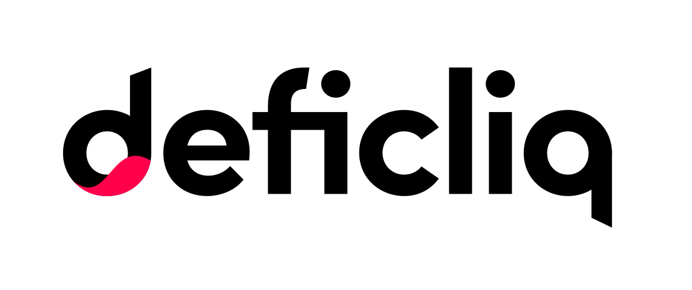

# Deficliq - The Place to unify all De-Fi Features

**Disclaimer:** Projects themselves entirely manage the content in this guide. Moonbeam is a permissionless network. Any project can deploy its contracts to Moonbeam.

## Introduction

Staking Smart Contract is based on the Defi Staking concept in which users can stake their token and Dev for a particular period of time and can get reward based on it.
Staking Contract work on modules like users can stake tokens and Dev for 30 days, 60 days, and 90 days respectively.

Rewards are defined which are based on the number of staking days.
The penalty will be applied on early withdrawal that means if the user withdraws a staked token or Dev before the stake end time, the penalty will be applicable.

The contract is divided into two contract 
 - **Cliq Token Smart Contract**
 - **Staking Contract**

The Staking Smart Contract ecosystem constitute two smart contract which work together, these are:
 - **Cliq Token Smart Contract** — ERC20 based smart contract for token functionality.
 - **Staking Contract** — Staking Smart contract with functionalities like stake token, reward and penalty and withdraw stake function.

You can read more about deficliq in the following links:

 - [deficliq Website](https://www.deficliq.com/)
 - [deficliq Github](https://github.com/deficliq/moonbeam_work)
 - [deficliq twitter](https://twitter.com/deficliq)

## Moonbase Alpha Implementation

Deficliq has deployed its core smart contract to the Moonbase Alpha TestNet.

In this Smart Contract you can do the following:
-> **Cliq Token Smart Contract**
   - [Token Smart Contract Address](https://moonbase-blockscout.testnet.moonbeam.network/address/0xBa6C068122C91E46304F3CBE768ddF8927BA4314/transactions)
   - Can transfer token from one address to another
   - Can burn particular amount of token
   - Can mint particular amount of token
   - Can approve particular amount of token via which further transfer can be happen.

-> **Staking Smart Contract**
   - [Staking Smart Contract Address](https://moonbase-blockscout.testnet.moonbeam.network/address/0x0a2105B5b02AF23db5d5779beA8Dd8184bA6Fc45/transactions)
   - Can stake particular amount of token
   - users can know their reward and penalty via functions
   - users acn withdraw their stake token
   - users can stake Dev and can earn rewards
   - users can withdraw Dev 

### Contract Information

You can find all the contracts relevant to the deficliq staking platform in [this GitHub repo](https://github.com/deficliq/moonbeam_work). 
Addresses that are relevant for the Moonbase Alpha implementation are outlined in the following table:

|             Contract             |                  Address                   |
| :-------------------------------:| :----------------------------------------: |
|      Token Contract Address      | 0xBa6C068122C91E46304F3CBE768ddF8927BA4314 |
|      Staking Contract Address    | 0x0a2105B5b02AF23db5d5779beA8Dd8184bA6Fc45 |
