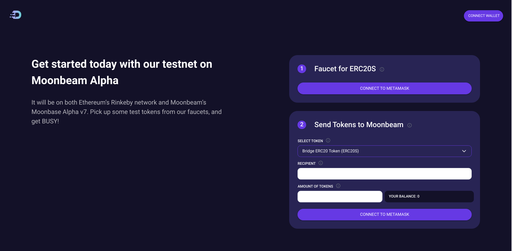
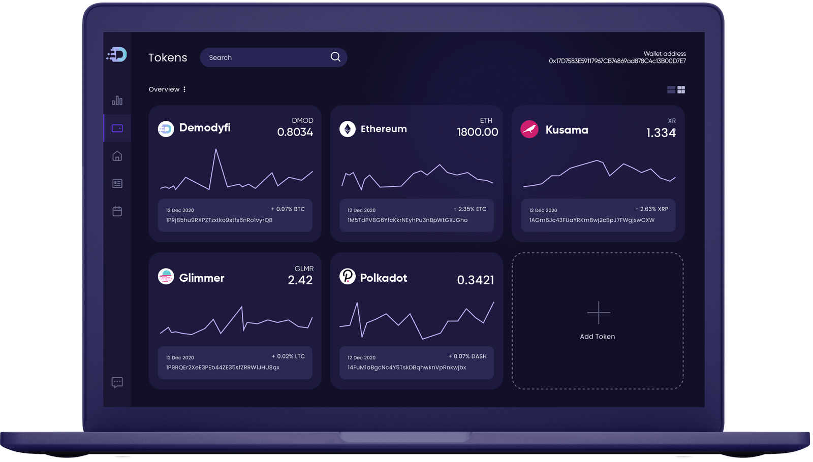

# Demodyfi - An AMM Cross-Chain DEX on Polkadot

**Disclaimer:** Projects themselves entirely manage the content in this guide. Moonbeam is a permissionless network. Any project can deploy its contracts to Moonbeam.

## Introduction

We are building a next-gen DEX that extends its DeFi product line to a one-stop cross-chain asset market. 

Also, the possibility of making both pools and cross-chain swaps, powered by the Polkadot ecosystem, can provide higher throughput for faster and cheaper transactions while staying connected to the Ethereum Network and other blockchains for liquidity.

Users will be able to trade multiple crypto assets from Demodyfi’s native DEX and use its convenient interface to manage their assets across multiple chains, non-custodial, using the Metamask and Polkadot.js extension wallets.

## Key-Benefits

- **Non-custodial**: Demodyfi allows users complete control over their funds. Thus, the risk associated with centralized exchanges, where one can lose his funds if the exchange gets hacked or goes bankrupt, is completely absent.

- **No KYC procedure**: Since users have full control over their funds, there is no need to go through the KYC procedure and disclose personal information. In this way, it is much faster to start using the exchange.

- **Low fees**: Demodyfi charges a flat fee of 0.3%* per trade like Uniswap. This is significantly cheaper than most decentralized exchanges.

- **Access to new coins and NFT**: Typically, in the case of centralized exchanges, different cryptocurrencies or DeFi projects must go through an exchange verification process before their coin or token is available to traders. However, since Demodyfi is decentralized and growing in popularity among the community, many companies choose to launch their projects directly on Demodyfi. This way, Demodyfi users can access new tokens before others.

- **Unified account experience**: Demodyfi is making this possible for the end-user by implementing efficient cross-chain swapping between wallets like Metamask and Polkadot.js.

## DMOD Token

|       Contract       |                  Address                   |
| :------------------: | :----------------------------------------: |
|       DMOD           | 0x5f6c5c2fb289db2228d159c69621215e354218d7 |

DMOD is designed to incentivize and reward token holders using the Demodyfi protocol by delivering the following benefits:

- Fee Discounts
- Staking Rewards
- Token Burns
- Reduced Slippage
- Liquidity Mining
- Governance

## Moonbase Alpha Implementation

We are working on a cross-chain swap and bridge platform frontend to allow users to manage their defi assets, postions and also access every functionality provided by the Demodyfi protocol.

All you'll need is Metamask or polkadot.js extension to get connected and then you can start playing around with the interface.

## More Info

You can learn more about Demodyfi from the following links:

 - [Website](https://demodyfi.com/)
 - [Docs site](https://docs.demodyfi.com/)
 - [Github](https://github.com/Demodyfi)
 - [Medium](https://demodyfi.medium.com/)

You can contact the team via the following communication channels:

 - [Twitter](https://twitter.com/demodyfi)
 - [Telegram](https://t.me/demodyficommunity)