Introduction

Offshift is pioneering the #PriFi space with the world&#39;s first Private Derivatives Platform that is fully decentralized, trustless, and on-chain - that is, in the Ethereum and Polkadot ecosystems.

 Our protocol leverages zero-knowledge (zk) proofs and sources reliable, real-time price feeds from Chainlink&#39;s decentralized oracle network to enable users to mint zkAssets, an unprecedented line of fully private synthetics. With Offshift, users can Shift back and forth between XFT and synthetics pegged to virtually any asset - be it a cryptocurrency, fiat currency, stock, gold, silver, or any other commodity, making for an unrivaled diversity of investment-grade derivatives all on one platform.

 In the months and years ahead, Offshift envisages the organic formation of a dynamic, privacy-centric DeFi ecosystem in which a diverse range of applications integrate zkAssets for a wide array of use cases, including various forms of staking, decentralized lending and borrowing, synthetic asset generation, and NFT minting.

To learn more about Offshift and our Private Derivatives Platform, visit the links below:

[Website](http://offshift.io/)
[Whitepaper](https://offshift.io/content/offshift_whitepaper_v1.pdf)
[Pitch Deck](https://offshift.io/content/offshift_pitchdeck_v2.pdf)
[GitLab](https://open.offshift.io/)
[Blog](https://medium.com/offshift)

To reach out and connect with our team and join our growing community, join us on the following platforms:

[Discord](https://discord.gg/9mZswcKRvz)
[Telegram](https://t.me/OffshiftXFT)
[Twitter](https://twitter.com/OffshiftXFT)
[Instagram](https://www.instagram.com/officialoffshift/)

Moonbase Alpha Implementation

Offshift has deployed our testnet to the Moonbase Alpha TestNet, which you can access via [this link](https://offshift.io/moonbeam-shift.html#). Using testnet tokens from our [faucet](https://offshift.io/moonbeam-faucet.html#), users can shift their testnet XFT into asset-pegged ERC-20 versions of our zkAssets.

To perform a shift on Moonbeam&#39;s TestNet, Moonbase Alpha, we&#39;ll be using [MetaMask](https://metamask.io/), so once you have the MetaMask browser extension installed, you&#39;re ready to begin.

1) If you&#39;re already a MetaMask user, we highly recommend creating a new wallet to use on testnet before you proceed, to avoid any potential confusion or unintended transfers.

2) First you&#39;ll need to configure MetaMask to connect to Moonbase Alpha TestNet. Click on your wallet&#39;s identicon in the top right, then click &quot;Settings.&quot;

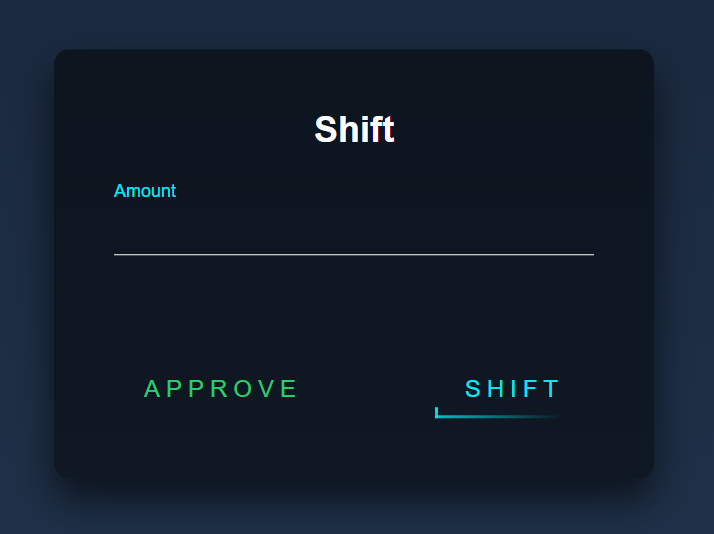

Navigate to the &quot;Networks&quot; tab, then click &quot;Add Network.&quot;

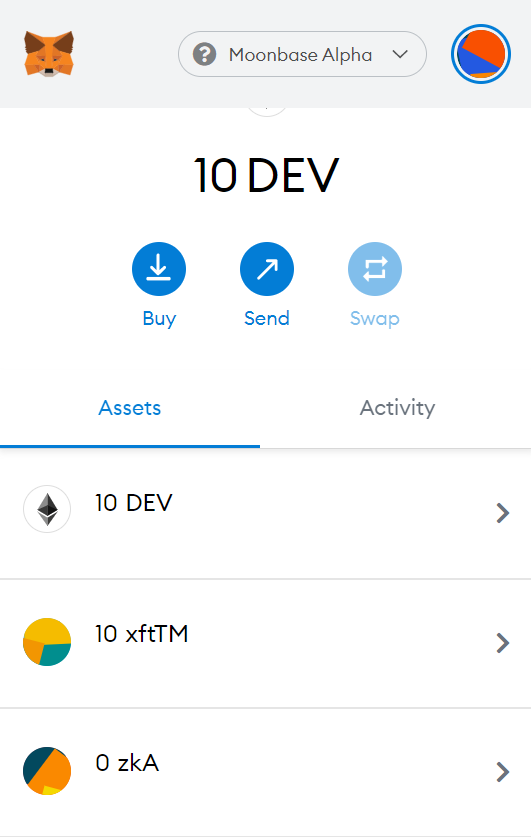

Configure MetaMask for the following network:

- Network Name: Moonbase Alpha
- New RPC URL: https://rpc.testnet.moonbeam.network
- ChainID: 1287
- Symbol (Optional): DEV

Click save, then proceed to step three.

3) To interact with Moonbase Alpha you&#39;ll need Moonbeam&#39;s native test asset, DEV. You can request DEV in the [Moonbeam Discord](https://discord.gg/M8b6GktCYx) in the #alphanet-bot channel by posting your MetaMask address in the format you&#39;ll see there [!faucet send 0x…].

4) We&#39;ll be interacting with Offshift&#39;s two test assets, xftTM and zkA, which are ERC-20 tokens deployed on Substrate via Moonbeam. You&#39;ll need to add these to MetaMask by selecting &quot;Add Token,&quot; circled in the image below.

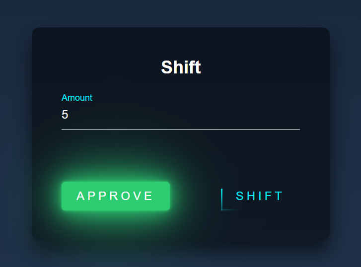

Then click &quot;Custom Token.&quot;

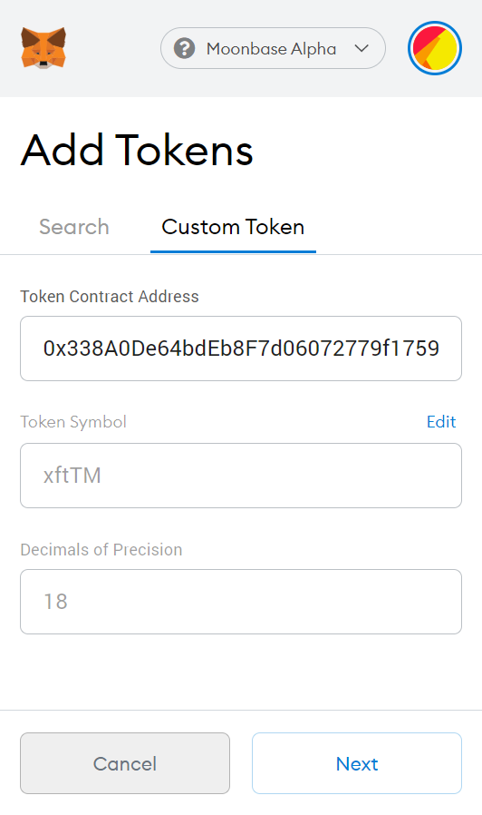

And copy/paste the xftTM address below into the Token Contract Address field.

xftTEST-Asset-Moonbeam (xftTM): 0x80e3c6De3027A421847df5333a82381aB99EE644

The Token Symbol and Decimals of Precision fields will auto-fill once you paste the contract address, then you&#39;ll click &quot;Next,&quot; and &quot;Add Token.&quot;

Repeat and also add zkA with the contract address below —

zkTEST-AssetB (zkB): 0xdF8876bb6C187992Fbc1d5B0A99e8382F62571aE

5) Request some xftTM tokens from our [Moonbeam TestNet Token Faucet](https://offshift.io/moonbeam-faucet.html#) by clicking the &quot;XFTTM (TESTNET-MOONBEAM) FAUCET&quot; button.

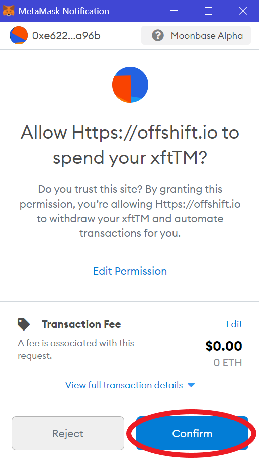

Then &quot;Confirm&quot; in MetaMask.

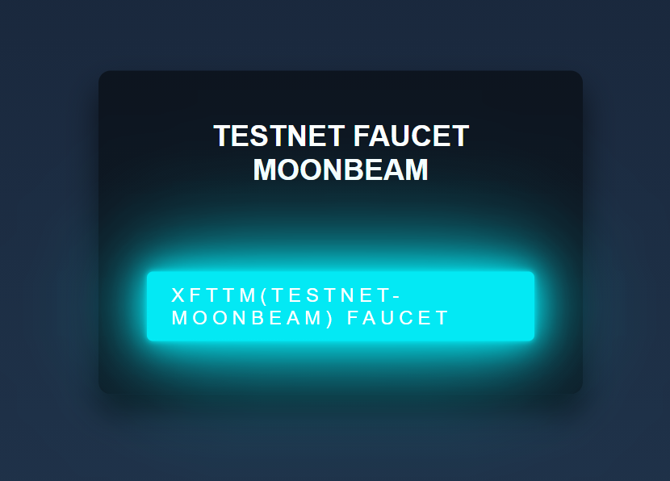

6) When you&#39;ve finished the steps above, you should have DEV and xftTM balances in your wallet, and you should have zkA listed with a balance of zero, like in the image below.

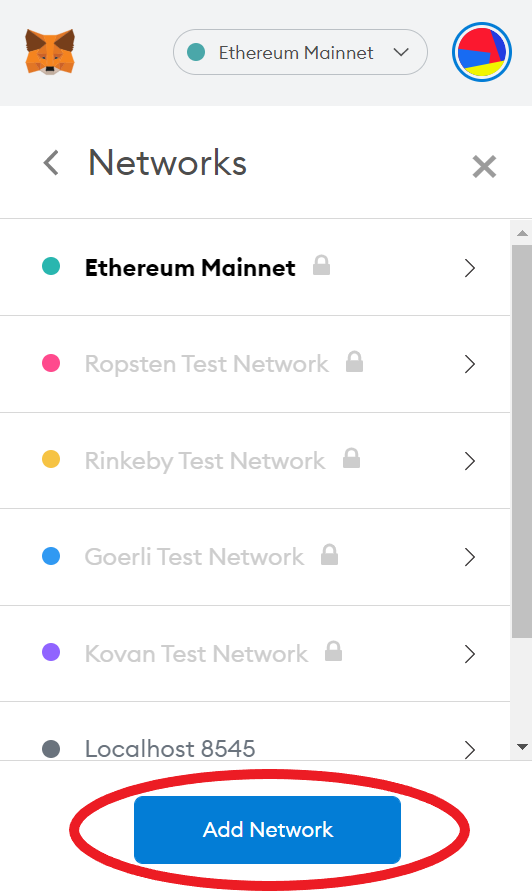

If you do, you&#39;re ready to shift on Moonbeam!

7) Navigate to our [Moonbeam Shifting Dashboard](https://offshift.io/moonbeam-shift.html#).

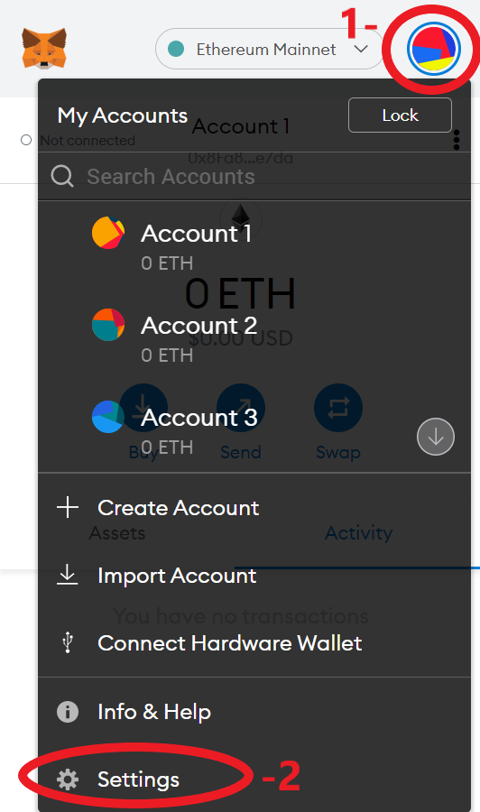

8) Enter the number of tokens you want to shift, then click &quot;Approve.&quot;

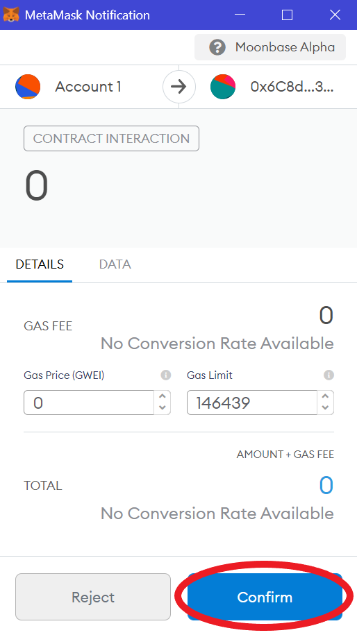

9) MetaMask will pop up and ask if you want to &quot;Allow https://offshift.io to spend your xftTM?&quot; Click &quot;Confirm.&quot;

10) Once the transaction to approve the xftTM spend has been confirmed (you can check the transaction status by clicking on the &quot;Activity&quot; tab in MetaMask), you&#39;re ready to shift.

Click &quot;Shift&quot; on the dashboard.

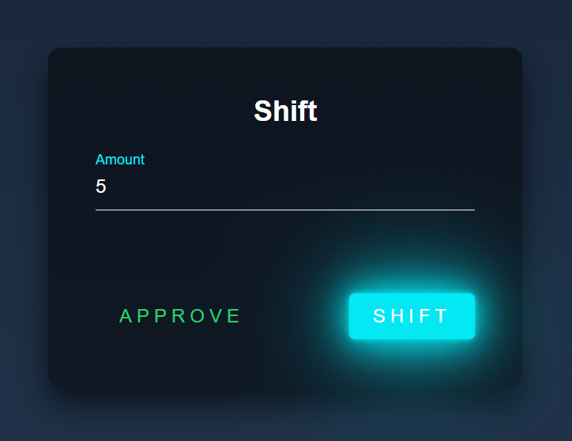

11) MetaMask will pop up again and ask you to approve the transaction. Click &quot;Confirm.&quot;

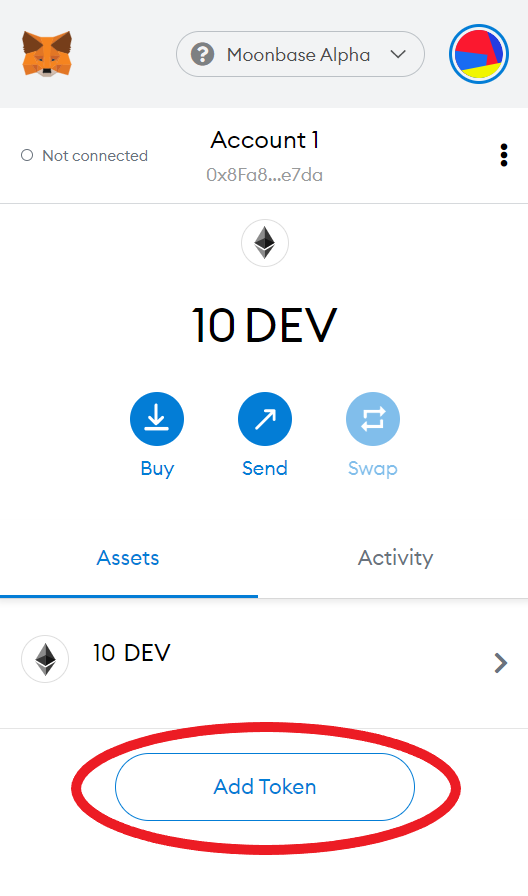

12) You&#39;ve shifted! Your xftTM will be burned and an equivalent value in zkA will be minted.

In the example above we shifted 5 xftTM to zkA.

Our wallet now shows 5 fewer xftTM, and a balance of 5 zkA.

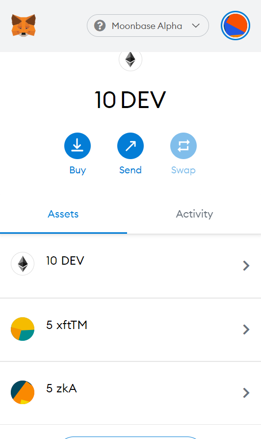

Contract Information

All contracts which are relevant to Offshift&#39;s Moonbeam Alpha implementation are listed in the table below:

| Contract | Address |
| --- | --- |
| xftTM | 0x090448B4d01579c720B96CC690025dc7438F6caE |
| xftTB | 0xDCd359bE263d6742b8bBd1295F38AE90AB755B4c |
| Shifting Contract | 0xE781288292fcd71d71cFD6727F4833178b209d32 |
