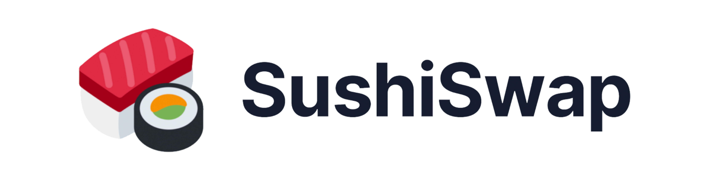
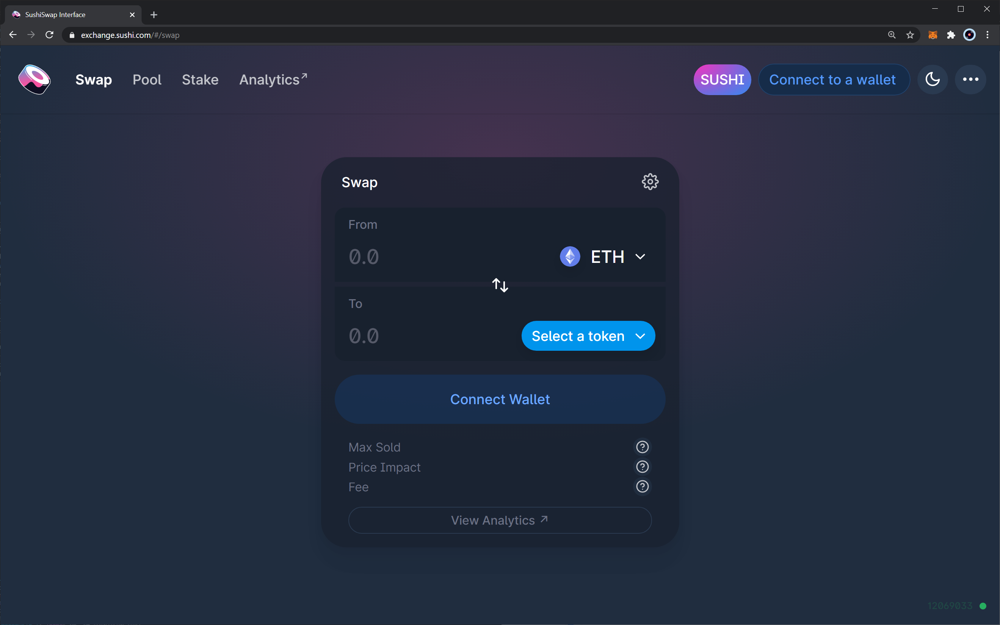
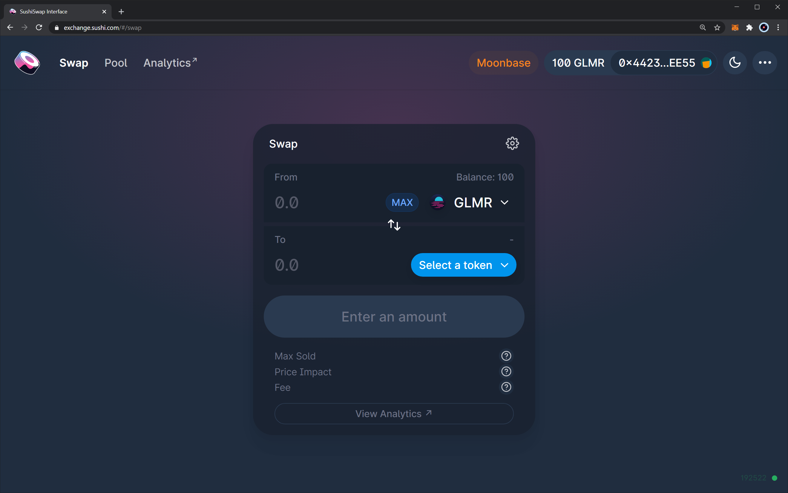

# SushiSwap - An AMA Multi-Chain DEX on Moonbeam

**Disclaimer:** Projects themselves entirely manage the content in this guide. Moonbeam is a permissionless network. Any project can deploy its contracts to Moonbeam.

## Introduction

SushiSwap is an automated market-maker (AMM) multi-chain decentralized exchange, which introduced revenue sharing for network participants.

SushiSwap is a community-run project governed by the community vote for all significant changes to the protocol. Day-to-day operations, rebalancing of pools and ratios, business strategy, and overall development is ultimately decided on by our Sushi Chef 0xMaki.

The SushiSwap's ecosystem offers a few core products:

 - **SushiSwap Exchange** — core exchange to swap ERC-20 tokens based on an AMM model
 - **SushiSwap Liquidity Pools** — offer a series of liquidity pools where anyone can provide liquidity and earn rewards in return
 - **SushiSwap SushiBar Staking (xSushi)** — allows you to stake your Sushi tokens and receive xSushi in return, which you can stake in the xSushi pool
 - **SushiSwap Bentobox** — a new an upcoming lending platform with new lending solutions

You can read more about SushiSwap in the following links:

 - [Website](https://sushi.com/)
 - [Docs site](https://docs.sushi.com/)
 - [SushiSwap Github](https://github.com/sushiswap)
 - [SushiSwap Medium](https://sushiswapchef.medium.com/)

You can contact the team via the following communication channels:

 - [Discord](https://discord.gg/NVPXN4e)
 - [Twitter](https://twitter.com/sushiswap)

## Moonbase Alpha Implementation

SushiSwap has deployed its core exchange platform to the Moonbase Alpha TestNet, which you can access via [this link](https://staging.sushi.com/). In this interface you can do the following:

 - Create a pair pool using two ERC-20 tokens (or the TestNet DEV utility token)
 - Add liquidity to an already existing pool
 - Swap tokens on already existing pools
 - Remove liquidity from pools you have added liquidity to
 - Earn a 0.25% fee on all trades proportional to your share of the liquidity pool

### Getting Started with the Interface

First, make sure you have MetaMask set up so that it connects to the Moonbase Alpha TestNet. To do so, you can follow [this guide](/integrations/wallets/metamask/). You can also get DEV tokens from their faucet by following [this tutorial](/getting-started/testnet/faucet/).

With MetaMask properly configured, open the exchange platform using [this link](https://staging.sushi.com/). In there, click on the "Connect to a wallet" button, and choose MetaMask.

MetaMask might display a pop-up menu requesting permission to connect the exchange with the wallet. Select the accounts you want to connect to the exchange and click "Next" and then "Connect." 

If everything was set up correctly, you should have the exchange interface connected to "Moonbase." In addition, your current account (in MetaMask) should be displayed in the top right corner, as well as its balance. Note that the balance is displayed as "GLMR," but this corresponds to "DEV," the TestNet token.

Once connected, you can start playing around the SushiSwap instance deployed to Moonbase Alpha!

### Contract Information

You can find all the contracts relevant to the SushiSwap deployment in [this GitHub repo](https://github.com/sushiswap/sushiswap). Addresses that are relevant for the Moonbase Alpha implementation are outlined in the following table:

|       Contract       |                  Address                   |
| :------------------: | :----------------------------------------: |
|       Factory        | 0x2Ce3F07dD4c62b56a502E223A7cBE38b1d77A1b5 |
|        Router        | 0xeB5c2BB5E83B51d83F3534Ae21E84336B8B376ef |
| WETH (WDEV actually) | 0xe73763DB808ecCDC0E36bC8E32510ED126910394 |