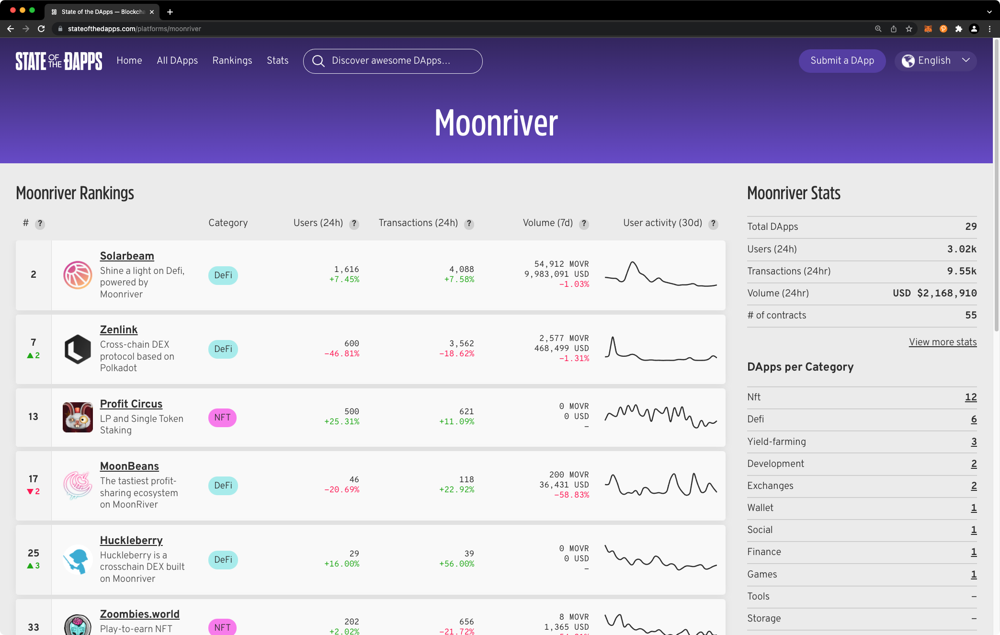

# How to List your Project/DApp
 


State of the DApps was started in 2016 by Joris Bontje to provide a convenient listing of all of the smart contracts or decentralized applications deployed to Ethereum. It has grown tremendously since then, supporting multiple chains and showcasing a wealth of information. 

In their own words, “Whether you are looking for new users, testers, concept feedback, partners, or investors, submitting a DApp (Decentralized Application) to this definitive registry will help your project gain traction.”

State of the DApps maintains a rank of projects based on active users, transaction volume, developer activity, and profile strength. Moonriver is live on State of the DApps and at the time of writing, both the 2nd and 7th top ranked projects across all ecosystems were built on Moonriver. Previously, a crowd-sourced DApps Listing was maintained here as part of the Moonbeam docs site. That registry is deprecated and replaced by State of the Dapps. 

**Disclaimer:** The content in this section is entirely managed by the projects themselves. Moonbeam is a permissionless network. Any project can deploy its contracts to Moonbeam. 



You can submit your project to the State of the Dapps by providing background on your project including a description of the DApp, screenshots, social media links, and a project status (such as Live, Beta, Prototype, etc). DApps are welcome at any stage in the product life cycle, including ones in the ideation phase. Only a subset of the fields are required, but you are encouraged to complete as many as possible, as providing a more thorough profile for your DApp will improve its ranking. 

## Minimum Content

We are now using State of the Dapps.

In general, to be considered and added to this list, your project/DApp must meet the following requirements in terms of content:

 - Introduction (see template file)
 - Show working contracts and/or front-ends deployed or connected to the Moonbase Alpha TestNet
 - Explain to users how they can test or integrate your project/DApp
 - Link the GitHub repos of the code
 - Link to communication channels

## Getting Started

This guide will help you get started on listing your project/DApp in the Moonbeam docs site.

### Forking/Cloning the Repo

The main idea is to fork a repository, modify it with your changes, and then submit a PR.

So, as mentioned before, first fork [this repository](https://github.com/PureStake/moonbeam-project-directory).

### Choose Category and Copy Template

Next, choose the category that relates to your project the most. There is a folder per category. If you think we are missing a category, contact us via our [Discord channel](https://discord.gg/PfpUATX), we are happy to add it to the list.

You can use the `template.md` file (which you can find [here](https://github.com/PureStake/moonbeam-project-directory/blob/master/template.md)) as reference.

For example, let's say your project is named "Rocket Project" and related to DeFi. Then, you would need to copy this file inside the following folder:

```
moonbeam-project-directory
|--apis
|--assets
|--bridges
|--defi
|--|--rocket-project.md
|--explorers
...
```

### Changing Title - Description - First Heading

With the file in the correct location, you can start adapting it to your specifications. Make sure to change the title, description, and first heading (all located at the top of the file). The title defines how the entry is named on the left-hand side navigation menu. The description is related to the metadata of the page:

```
---
title: Rocket Project (title example)
description: Rocket Project DeFi integration in Moonbase Alpha to access the Multi-Chain future and the Polkadot Ecosystem (description example)
---

# Rocket Project - DeFi Multi Chain (title example)
```

### Images

Images related to your documentation can be saved inside the `images` folder, located in the repo's main directory. Please create a folder where to save your images. For our previous example, this would be in:

```
moonbeam-project-directory
|--apis
...
|--defi
|--explorers
|--images
|--|--rocket-project
|--|--|--image1.png
|--|--|--image2.svg
|--marketplaces
...
```

## Submitting PR

Once you are done with your documentation, you can submit your pull-request from your forked repo.

Our team will check this PR to make sure it complies with the minimum requirements to be listed.
