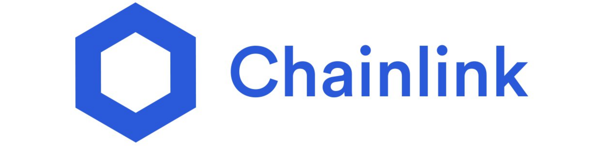

# Chainlink Oracles on Moonbeam



**Disclaimer:** Projects themselves entirely manage the content in this guide. Moonbeam is a permissionless network. Any project can deploy its contracts to Moonbeam.

## Introduction

Chainlink is a decentralized oracle network that provides reliable tamper-proof inputs and outputs for complex smart contracts on any blockchain. In simpler terms, Chainlink enables your smart contracts to access real-world data securely.

Chainlink's oracle solution is now available on the Moonbase Alpha TestNet. Two types of oracle request models are available:

 - **Basic Request Model** — a simple model where a user requests a transaction, and a single oracle source fulfills that request. Although simple, it relies on the user trusting the oracle source as the source of truth
 - **Decentralized Data Model** — adds an on-chain aggregation data, where data is aggregated from a decentralized network of independent oracle nodes. One example is Chainlink Price Feeds, which aggregate asset price data

You can read more about Chainlink in the following links:

 - [Website](https://chain.link/)
 - [Docs site](https://docs.chain.link/docs)
 - [Github](https://github.com/smartcontractkit/chainlink)
 - [YouTube](https://www.youtube.com/chainlinkofficial)

You can contact the team via the following communication channels:

 - [Discord](https://discord.gg/aSK4zew)
 - [Twitter](https://twitter.com/chainlink)
 - [Telegram](https://t.me/chainlinkofficial)
 - [WeChat](https://blog.chain.link/chainlink-chinese-communities/)
 - [Reddit](https://www.reddit.com/r/Chainlink/)

## Moonbase Alpha Implementation

Chainlink oracle solution and smart contracts are currently deployed in the Moonbase Alpha TestNet with both Kovan and Rinkeby Ethereum's TestNets.

### Basic Request Model

You can find all the contract's addresses that are relevant Basic Request Model in the following table:

|  Contract           |   |                    Address                      |
|:-------------------:|---|:-----------------------------------------------:|
| Oracle Contract     |   |{{ networks.moonbase.chainlink.oracle_contract }}|
| LINK Token          |   | {{ networks.moonbase.chainlink.link_contract }} |


The initial request can be made by using the following Client contract, which you can deploy to the Moonbase Alpha TestNet using Remix and MetaMask. When deploying the contract, you need to provide the LINK token address.

```solidity
--8<-- 'chainlink/Client.sol'
```

Once deployed, you have the `requestPrice()` function. This function initiates the request that is fetched by the oracle via events emitted by the oracle contract. The function needs the oracle address, the job specification ID, and the payment to be sent to the oracle (for TestNet purposes, it can be set to zero). The job specification ID (job ID for short) relates to the request type you make to the oracle. The list of job IDs available is presented in the following table:

|  Base/Quote    |   |                Job ID Reference                 |
|:--------------:|---|:-----------------------------------------------:|
| BTC to USD     |   | {{ networks.moonbase.chainlink.basic.btc_usd }} |
| ETH to USD     |   | {{ networks.moonbase.chainlink.basic.eth_usd }} |
| DOT to USD     |   | {{ networks.moonbase.chainlink.basic.dot_usd }} |
| KSM to USD     |   | {{ networks.moonbase.chainlink.basic.ksm_usd }} |
| AAVE to USD    |   | {{ networks.moonbase.chainlink.basic.aave_usd }}|
| ALGO to USD    |   | {{ networks.moonbase.chainlink.basic.algo_usd }}|
| BAND to USD    |   | {{ networks.moonbase.chainlink.basic.band_usd }}|
| LINK to USD    |   | {{ networks.moonbase.chainlink.basic.link_usd }}|
| SUSHI to USD   |   |{{ networks.moonbase.chainlink.basic.sushi_usd }}|
| UNI to USD     |   | {{ networks.moonbase.chainlink.basic.uni_usd }} |

Once you sent a request as a transaction. The oracle will fulfill this request and write the result to the `currentPrice` variable.

### Price Feeds

A decentralized oracle network updates price feeds. Each oracle node is rewarded for publishing the price data to an Aggregator contract. The information is only updated if a minimum number of responses from Oracle nodes are received (during an aggregation round).

The end-user can retrieve price feeds with read-only operations via a Consumer contract, referencing the correct Aggregator interface (Proxy contract). The Proxy acts as a middleware to provide the Consumer with the most up-to-date Aggregator for a particular price feed. 

Each price feed can be read using a straightforward contract interface pointed to the corresponding consumer contract:


```solidity
pragma solidity ^0.6.6;

interface ConsumerV3Interface {
    /**
     * Returns the latest price
     */
    function getLatestPrice() external view returns (int);

    /**
     * Returns the decimals to offset on the getLatestPrice call
     */
    function decimals() external view returns (uint8);

    /**
     * Returns the description of the underlying price feed aggregator
     */
    function description() external view returns (string memory);
}
```

This interface provides the following functions:

 - **getLatetPrice** — returns the latest price available in the consumer contract
 - **decimals** — returns the decimals of the corresponding price feed, as numbers in smart contracts are represented as unsigned integers
 - **description** — returns a brief description of the price feed being queried

Currently, there is a consumer contract for the following price pairs:

|  Base/Quote    |   |                Consumer Contract                 |
|:--------------:|---|:-----------------------------------------------:|
| BTC to USD     |   | {{ networks.moonbase.chainlink.feed.consumer.btc_usd }} |
| ETH to USD     |   | {{ networks.moonbase.chainlink.feed.consumer.eth_usd }} |
| DOT to USD     |   | {{ networks.moonbase.chainlink.feed.consumer.dot_usd }} |
| KSM to USD     |   | {{ networks.moonbase.chainlink.feed.consumer.ksm_usd }} |
| AAVE to USD    |   | {{ networks.moonbase.chainlink.feed.consumer.aave_usd }}|
| ALGO to USD    |   | {{ networks.moonbase.chainlink.feed.consumer.algo_usd }}|
| BAND to USD    |   | {{ networks.moonbase.chainlink.feed.consumer.band_usd }}|
| LINK to USD    |   | {{ networks.moonbase.chainlink.feed.consumer.link_usd }}|
| SUSHI to USD   |   |{{ networks.moonbase.chainlink.feed.consumer.sushi_usd }}|
| UNI to USD     |   | {{ networks.moonbase.chainlink.feed.consumer.uni_usd }} |
