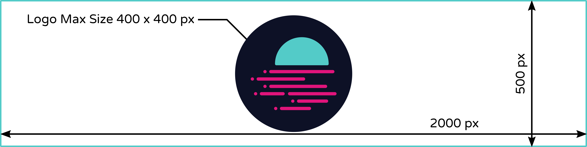

# Title of Project/dApp with TitleCase



**Disclaimer:** Projects themselves entirely manage the content in this guide. Moonbeam is a permissionless network. Any project can deploy its contracts to Moonbeam.

## Introduction

This file outlines a template that should be followed when listing projects in this directory. 

This first section should be an introduction to your project/dApp. You may include:

 - High-level explanation of what does it do?
 - What value it brings to the user
 - Links to important information (token faucet, tutorials, the information you deem necessary)

## Content and Structure

This section covers the minimum content necessary to be listed and the structure of the files.

### Minimum Content

In general, to be considered and added to this list, your project/dApp must meet the following requirements in terms of content:

 - Introduction (see the "Introduction" section)
 - Show working contracts and/or front-ends deployed or connected to the Moonbase Alpha TestNet
 - Explain to users how they can test or integrate your project/dApp
 - Link the GitHub repos of the code
 - Link to communication channels

### Getting Started

To get started, you need to clone the following repository:

```
git clone https://github.com/PureStake/moonbeam-project-directory
cd moonbeam-project-directory
```

Next, you can copy this file (or its content) and create a new one inside the repository folder that relates the most to your project. For example, let's say your project is named "Rocket Project" and related to DeFi. Then, you would need to copy this file inside the following folder:

```
moonbeam-project-directory
|--apis
|--assets
|--bridges
|--defi
|--|--rocket-project.md
|--explorers
...
```

With the file in the correct location, you can start adapting it to your specifications. Make sure to change the title, description, and first heading (all located at the top of the file). The title defines how the entry is named on the left-hand side navigation menu. The description is related to the metadata of the page:

```
---
title: Rocket Project (title example)
description: Rocket Project DeFi integration in Moonbase Alpha to access the Multi-Chain future and the Polkadot Ecosystem (description example)
---

# Rocket Project - DeFi Multi Chain (title example)
```

Images related to your documentation can be saved inside the `images` folder located in the main directory of the repo. Please create a folder where to save your images. For our previous example this would be in:

```
moonbeam-project-directory
|--apis
...
|--defi
|--explorers
|--images
|--|--rocket-project
|--|--|--image1.png
|--|--|--image2.svg
|--marketplaces
...
```

## Docs Standards

Here you will find some standard rules to write the documentation.

Docs are written in regular Markdown with some plugins available. For reference, the site is generated using [mkdocs](https://www.mkdocs.org/), with a material design theme that you can find [here](https://github.com/squidfunk/mkdocs-material).

As mentioned before, each title/heading must be written with Title Case. You can find a straightforward converter [here](https://titlecase.com/).

Avoid using H4, that is, headings with `####`.

### Bullet Lists

When a bullet list refers to some parameter definitions, use the following structure:

```
Some text here:

 - **Def1** — some text here
 - **Def2** — some text here
 - **Def3** — some text here
 - **Def4** — some text here
```

Some key takeaways:

 - Bullets should always start with ` - `, meaning there is a space + dash + space
 - The parameter being defined will be in bold caps
 - Between the parameter and the definition, there will be a long dash `—`
 - Always leave a space before the bullet list and after the bullet list
 - There is no `.` at the end of each point

When bullet lists are for describing steps (or anything different than defining stuff), you can use the following structure:

```
Some text here:

 - Some text here
 - Some text here
 - Some text here
 - Some text here
```
 
Some key takeaways:

 - Bullets should always start with ` - `, meaning there is a `space + dash + space`
 - Always leave a space before the bullet list and after the bullet list
 - There is no `.` at the end of each point

### Images

Before you add images to your documentation, please first create a directory (with a name related to your project/dApp) inside the `images` folder. 

With the folder created, you can add images to your documentation page using the following structure:

```

```

In general, most common image formats are supported, such as: PNG, JPEG, TIFF, and SVG.

## Plugins Available

Many of the plugins available in this docs site can be found in [this link](https://squidfunk.github.io/mkdocs-material/reference/abbreviations/). This section will cover only the most useful plugins available.

### Code Snippets

Any code, text, or command that you want users to copy and paste easily can be added with the code snippet functionality. To do so, you wrap the code, text and/or command with three consecutive backticks (` ``` `). You can use the following structure:

````
```
This a code that is inside a code snippet block. 
Hover over this box and you will see a click-to-copy button.
```
````

Some key takeaways:

 - It is good practice to leave an empty line before and after the code snippet
 - Code snippets must start with at least three backticks (` ``` `). You can use more as long as you use the same number to open/close the snippet
 - You can specify the language of the block in the opening ticks. For example, for `python` code, you can use ` ```python `. A full list of available lexers can be found [here](https://pygments.org/docs/lexers/) 

### Content Tabs

In some cases, you might want to group alternative content under different tabs. For example, you are describing a code snippet in various languages. Content tabs allow you to wrap content in a single block. This block offers different tabs that will change the content depending on how you configure it. To do so, you can use the following structure:

```
=== "Option1"
    ```
    code snippet one
    ```

=== "Option2"
    ```
    code snippet two
    ```

=== "Option3"
    ```
    code snippet three
    ```
```

Some key takeaways:

 - There must be an empty line before and after the tabbed content code block
 - Tabbed content is not limited to code snippets only (although it might be the most common use-case). You can use it as well with text and images
 - The format is strict. This means that it must start with three equal signs (`===`) followed by a space, and then the title wrapped in quotation marks. The content of the tab must be listed just below, indented with four spaces

### Adding Notes

The notes option (`!!! note`) is super helpful when you want users to read some specific information. Notes can have custom titles with the following syntax `!!! note “Your Title Here”`. To do so, you can use the following structure:

```
Some text here.

!!! note
    This is a note. There is an empty line before the !!! note syntax, 
    and one right after this text. Note that this sentence will end with a dot.
    
Some text here
```

Some key takeaways:

 - There must be an empty line before and after the note block
 - There are empty spaces between `!!!` and `note`
 - The text contained in the note must be indented four spaces. If not, the note will not be generated correctly

### Tables

Tables can be used as well and can contain arbitrary Markdown code. As a reference, you can use this online [table generator](https://www.tablesgenerator.com/markdown_tables). To create a table, you can use the following structure:

```
| Table       | Example                     |
| :---------: | :-------------------------: |
| `ONE`       | :one:       Fetch resource  |
| `TWO`       | :two:       Update resource |
| `Three `    | :three:     Delete resource |
```

You can read more about Markdown tables [here](https://github.com/adam-p/markdown-here/wiki/Markdown-Cheatsheet#tables).
